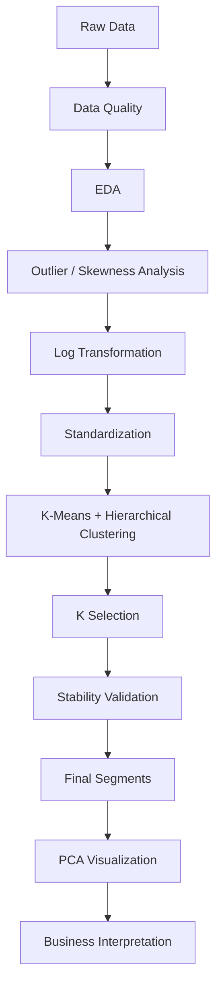

# Week 3 Customer Segmentation

This project uses exploratory analysis, log transformation, standardization, K-Means clustering, hierarchical clustering, stability validation, PCA visualization, and business profiling to segment wholesale customers based on annual spending.

## Project Architecture



## How to Run

1. Create a virtual environment.
2. Install dependencies:
   ```bash
   pip install -r requirements.txt
   ```
3. Confirm the raw dataset is located at:
   `data/raw/wholesale_customers.csv`
4. Run the complete reproducible pipeline:
   ```bash
   python -m src.run_pipeline
   ```
5. Generated processed data is saved to `data/processed/`.
6. Generated figures are saved to `figures/`.
7. Report content and interpretation outputs are saved to `reports/`.
8. The final PDF report is kept at:
   `reports/Wholesale_Customer_Segmentation_Report.pdf`

## Notebook Workflow

The notebooks document the same canonical pipeline in phases 01 through 10. Reusable analytical logic is maintained under `src/` so the notebooks do not contain separate copies of the core implementation.

Run the notebooks in order when a notebook-based walkthrough is required:

`01 -> 02 -> 03 -> 04 -> 05 -> 06 -> 07 -> 08 -> 09 -> 10`

## Environment

The executed notebooks and final report were produced with Python 3.13.5. Exact package versions are pinned in `requirements.txt`, including pandas 2.2.3, NumPy 2.3.5, scikit-learn 1.8.0, SciPy 1.17.0, Matplotlib 3.10.8, Seaborn 0.13.2, JupyterLab 4.5.3, Notebook 7.5.3, and pytest 9.0.2.

## Final Results

The reproducible pipeline selected **K=2** as the final K-Means solution. K=2 achieved the highest K-Means silhouette score among the stability-qualified candidates: **0.2903**. The same K was also the best hierarchical-clustering cross-check, with a silhouette score of **0.2585**.

The stability checks passed for the selected solution:

- Seed-variation mean ARI: **1.0000**
- Bootstrap mean ARI: **0.9195**
- Project stability threshold: **0.75**

The final segmentation contains two customer groups:

| Cluster | Customers | Share | Primary pattern | Mean total annual spend |
| --- | ---: | ---: | --- | ---: |
| Cluster 0 | 252 | 57.3% | Horeca-dominant; Fresh/Frozen buyers | 24,529 |
| Cluster 1 | 188 | 42.7% | Retail-dominant; Grocery/Milk buyers | 44,884 |

## Key Findings

1. **The segmentation is a broad two-group business split.** Cluster 0 is 96.8% Horeca, while Cluster 1 is 71.3% Retail. Channel was excluded from clustering and used only for post-hoc profiling, so this alignment is contextual evidence rather than external validation.

2. **Cluster 0 is driven primarily by Fresh and Frozen spending.** Its mean annual spend is 13,973 for Fresh and 3,706 for Frozen.

3. **Cluster 1 is driven primarily by Grocery and Milk spending.** Its mean annual spend is 14,697 for Grocery and 10,346 for Milk.

4. **Cluster 1 has substantially higher average annual spend.** Mean total annual spend is 44,884 versus 24,529 for Cluster 0.

5. **K=2 is more defensible than higher-K alternatives under the project's stability rule.** K=3 also passed stability, but its K-Means silhouette was lower at 0.2583. K=4 failed the bootstrap stability requirement with mean ARI 0.6242, below the 0.75 threshold.

These findings are decision-support hypotheses, not causal claims. The dataset is a single annual-spend snapshot and does not measure promotion response, margin, delivery frequency, customer tenure, or customer lifetime value.

